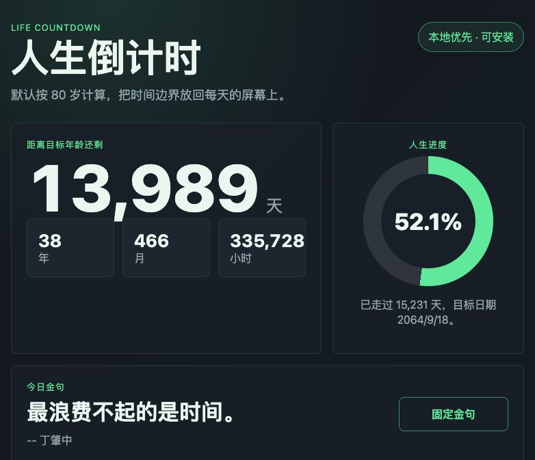

# Life Countdown

[](LICENSE)
[](assets/manifest.webmanifest)
[](https://github.com/gelibing8-rgb/life-countdown/pulls)

一个开源的人生倒计时与安全守护项目。默认按 80 岁计算，帮助用户在手机、电脑和可穿戴设备生态中，低打扰地看到“还剩多久”，同时让独居者、老人或需要关心的人每天向可信联系人完成一次平安确认。

> 当前版本是 PWA 原型：数据仅保存在本地浏览器，支持手机添加到主屏幕、每日提醒、进度可视化、平安打卡信息生成和本地导出。Apple Watch、Wear OS、手环、Apple Health、Health Connect、短信/邮件服务等深度接入作为后续开放路线图推进。

## English Summary

Life Countdown is a local-first, privacy-conscious PWA with two core goals: life countdown and daily safety guardianship. It shows how much time remains under a default 80-year life horizon, and helps people living alone, older adults, or vulnerable users send a lightweight daily safety check-in to trusted contacts.

Current scope:

1. Runs as a static PWA with no backend account system.
2. Stores birth date, target age, reminder time, contacts, and check-in state locally.
3. Generates daily safety check-in links through `sms:` and `mailto:` without sending messages silently.
4. Generates emergency `tel:`, `sms:`, and `mailto:` links for trusted-contact help requests.
5. Includes a daily humanistic quote that can be pinned by the user.
6. Provides a roadmap for Apple Watch, Wear OS, Health Connect, and Apple Health integration.

Live demo target:

```text
https://gelibing8-rgb.github.io/life-countdown/
```

## Project Status

This is an early open-source project with a working MVP, public repository, privacy notes, roadmap, release history, and PR-based iteration history. The next priority is to harden the safety-guardian workflow, add tests, improve accessibility for older users, and document wearable and notification integration boundaries.

## Project Docs

1. [Roadmap](docs/roadmap.md)
2. [Privacy](PRIVACY.md)
3. [Security](SECURITY.md)
4. [Contributing](CONTRIBUTING.md)
5. [Maintainer Notes](docs/maintainer-notes.md)
6. [Open Source Maintenance Plan](docs/oss-maintenance-plan.md)
7. [Release Checklist](docs/release-checklist.md)
8. [GitHub Pages Deployment](docs/github-pages.md)
9. [Accessibility Checklist](docs/accessibility-checklist.md)
10. [Privacy Impact Checklist](docs/privacy-impact-checklist.md)
11. [iOS Shortcut Check-In Flow](docs/ios-shortcut-check-in.md)
12. [Android Widget Options](docs/android-widget-options.md)
13. [Safety Guardian Notes](docs/safety-guardian.md)
14. [Wearable Integration Notes](docs/wearable-integration.md)
15. [Suggested Issue Backlog](docs/issue-backlog.md)
16. [Reviewer Evidence](docs/reviewer-evidence.md)
17. [Codex for Open Source Application Notes](docs/pro-application.md)
18. [Codex for Open Source Submission Draft](docs/application-submission.md)
19. [Project Impact And Maintenance Commitment](docs/project-impact.md)
20. [Application Status Update - 2026-07-30](docs/application-status-2026-07-30.md)

## 项目目标

一、人不是缺少时间，而是缺少对时间边界的稳定感知；很多独居者和老人，也缺少一种低打扰、可持续的每日安全确认机制。

Life Countdown 用一个极简界面显示：

1. 已经走过多少天；
2. 距离默认 80 岁还剩多少天；
3. 本周、本月、本年的进度；
4. 今天最重要的一件事；
5. 每日固定时间提醒；
6. 每日人文金句，可固定喜欢的句子；
7. 每日首次打开自动生成平安打卡信息；
8. 一键生成给守护联系人发送的短信和邮件打卡信息；
9. 一键生成电话、短信、邮件求救入口。

项目面向长期主义、个人效率、独居安全、老人关怀、健康管理和可穿戴设备用户，强调隐私、本地优先和可解释。

## 项目预览



## 核心特性

1. 默认寿命按 80 岁计算，可自定义；
2. 生日、目标年龄和提醒时间仅保存在本地；
3. 支持手机浏览器安装为 PWA；
4. 支持每日提醒权限申请；
5. 支持 JSON 数据导出；
6. 支持深色工业风界面；
7. 支持联系人手机、邮箱本地保存，并生成 `sms:` 与 `mailto:` 打卡入口；
8. 支持安全守护模式：每日首次打开自动生成平安打卡；
9. 支持一键求救入口：`tel:`、紧急 `sms:`、紧急 `mailto:`；
10. 无后端、无账号、无追踪；
11. 适合继续扩展到 Apple Health、Health Connect、快捷指令、短信/邮件服务、智能手表表盘和桌面小组件。

## 安全守护场景

Life Countdown 的第二个核心是“安全守护”。

典型场景：

1. 独居老人每天早上打开应用，系统自动生成一条“今日平安打卡”；
2. 用户点击短信或邮件入口，把打卡信息发送给子女、亲属或照护联系人；
3. 联系人收到的信息包括打开日期、平安确认状态、人生倒计时摘要和当日金句；
4. 紧急情况下，用户点击“一键求救”，生成拨打电话、求救短信和求救邮件入口；
5. 后续版本可扩展为定时提醒、未打卡提示、家庭守护端、可穿戴设备确认和服务端通知。

当前网页版本不会静默自动拨号、发送短信或发送邮件。原因是浏览器和手机系统通常要求用户确认外发动作，这也是避免误发、滥发和隐私风险的必要边界。

## 快速运行

直接打开 `index.html` 即可使用。

本地预览也可以运行：

```bash
python3 -m http.server 5173
```

然后访问：

```text
http://127.0.0.1:5173
```

## 目录结构

```text
.
├── index.html
├── src
│   ├── app.js
│   └── styles.css
├── assets
│   ├── icon.svg
│   └── manifest.webmanifest
├── docs
│   ├── accessibility-checklist.md
│   ├── android-widget-options.md
│   ├── application-improvement-checklist.md
│   ├── application-status-2026-07-30.md
│   ├── github-pages.md
│   ├── ios-shortcut-check-in.md
│   ├── issue-backlog.md
│   ├── maintainer-notes.md
│   ├── oss-maintenance-plan.md
│   ├── privacy-impact-checklist.md
│   ├── pro-application.md
│   ├── release-checklist.md
│   ├── roadmap.md
│   ├── safety-guardian.md
│   └── wearable-integration.md
├── LICENSE
└── README.md
```

## 设备关联路线

当前版本不读取任何健康数据，也不访问账号或云端服务。

后续可按低风险顺序扩展：

1. 手机端：PWA 安装、通知、桌面快捷入口；
2. iPhone：通过快捷指令把每日倒计时写入备忘录、日历或小组件数据源；
3. Android：通过 Health Connect 或桌面小组件显示；
4. Apple Watch / Wear OS：通过独立表盘 complication 或同步小组件显示；
5. 手环：优先采用厂商开放 API 或系统健康数据桥接，避免逆向和高风险登录；
6. 一键求救：先通过手机端确认式 `tel:`、`sms:`、`mailto:` 实现，再研究 Apple Watch、Wear OS 或快捷指令触发；
7. 家庭守护：在用户明确授权后，接入短信、邮件或消息服务，实现未打卡提醒和照护联系人通知。

## 隐私原则

1. 本项目默认不上传生日、年龄、目标、提醒时间；
2. 不接入广告 SDK；
3. 不做用户画像；
4. 后续如接入健康数据，必须坚持最小权限、用户显式授权和本地优先。

## 开源协议

MIT License。
